# Elementary Data Project

## Introducción

Elementary es una herramienta de *data observability* que permite monitorear, detectar y diagnosticar problemas en los datos antes de que impacten en los usuarios finales. Se integra directamente con **dbt**, aprovechando sus modelos, tests y metadatos para generar métricas de observabilidad de forma automática.

Con esta integración, Elementary puede identificar anomalías como cambios inesperados en el volumen de datos, valores nulos, inconsistencias, problemas de frescura o fallos en los tests de **dbt**. La herramienta está diseñada para trabajar sobre **data warehouses** modernos como Postgres, BigQuery, Snowflake o Databricks, sin necesidad de mover los datos fuera del entorno del cliente.

Elementary también ofrece monitoreo histórico, alertas y análisis de causa raíz, facilitando el mantenimiento y la confiabilidad de los pipelines de datos en producción.

<p align="center"> 
  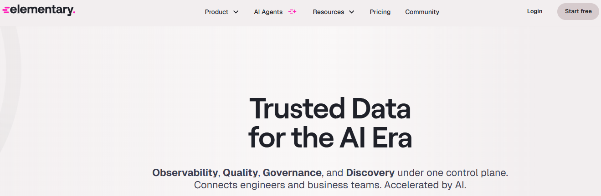 
</p>

## Configuración del entorno

Para comenzar, creamos un entorno virtual de Python y lo activamos:

```bash
python -m venv .venv
.venv\Scripts\activate
```

Actualizamos pip y luego instalamos **dbt** y **Elementary**:

```bash
pip install --upgrade pip
pip install dbt-postgres elementary-data
```

### Estructura del proyecto dbt

El proyecto contiene los siguientes archivos principales:

* **models/sources.yml**: definición de la fuente `barcelona_temp_source` apuntando a `temp_db.public.barcelona_monthly_temp`.
  *Tests añadidos:* `not_null` y `unique` sobre la columna `any_year`.

* **models/staging/stg_barcelona_temp.sql**: modelo de staging que limpia y selecciona las columnas necesarias.

* **models/staging/stg_barcelona_temp.yml**: esquema de staging con tests de integridad de datos.
  *Tests añadidos por columna:*

  * `any_year`: `not_null`, `unique`
  * Cada columna mensual (`temp_gener`, `temp_febrer`, etc.): `not_null` y rango aceptable con `dbt_utils.accepted_range` (-20 a 50)
    Además, se añadió un test de unicidad a nivel de modelo para asegurar una fila por año (`unique_combination_of_columns`).

* **models/marts/agg_barcelona_temp.sql**: modelo que genera métricas agregadas, incluyendo la temperatura media anual calculada a partir de los 12 meses.

* **models/marts/agg_barcelona_temp.yml**: esquema del modelo de métricas agregadas con tests de integridad.
  *Tests añadidos:*

  * `any_year`: `not_null`, `unique`
  * `temp_media_anual`: `not_null` y rango aceptable con `dbt_utils.accepted_range` (5 a 30)
  * Columnas mensuales: `not_null`
  * Test de unicidad a nivel de modelo para `any_year`

## Integración de Elementary con dbt

Para integrar **Elementary**:

1. Añadir a **packages.yml**:

```yaml
packages:
  - package: elementary-data/elementary
    version: 0.15.2
```

2. Instalar dependencias:

```bash
dbt deps
```

3. Configurar el esquema donde **Elementary** almacenará sus métricas en **dbt_project.yml** y activar flags necesarios:

```yaml
  elementary:
    +schema: "elementary"
```

4. Conectar **Elementary** al warehouse configurando **profiles.yml**. Esto permite que **Elementary** lea los artifacts de dbt (`manifest.json`, `run_results.json`) y genere métricas de observabilidad sin mover los datos.

5. Generar el perfil de **Elementary**:

```bash
dbt run-operation elementary.generate_elementary_cli_profile --profiles-dir C:\Users\{user}\.dbt
```

*Nota:* Instalar Elementary de forma específica si fuera necesario para otra plataforma (Postgres no requiere este paso):

```bash
pip install 'elementary-data[bigquery]'
```

## Datos y dashboards sin errores

Después de ejecutar los modelos de **dbt**:

```bash
dbt run
dbt test
```

Vista de la tabla y dos views en **Postgres**:

<p align="center"> 
  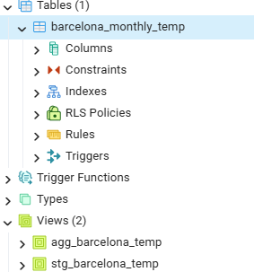 
</p>

Tabla `stg` en **Postgres**:

<p align="center"> 
  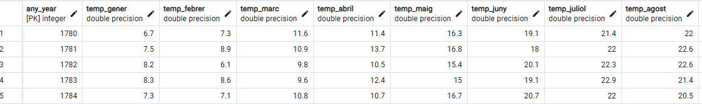 
</p>

Tabla `agg` en **Postgres**:

<p align="center"> 
  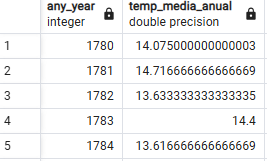 
</p>

Ejecutando `dbt run --select elementary`:

<p align="center"> 
  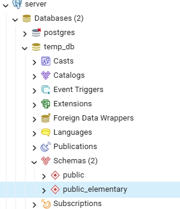 
</p>

Ejecutando `edr report`, el dashboard de **Elementary** con todos los tests pasados:

<p align="center"> 
  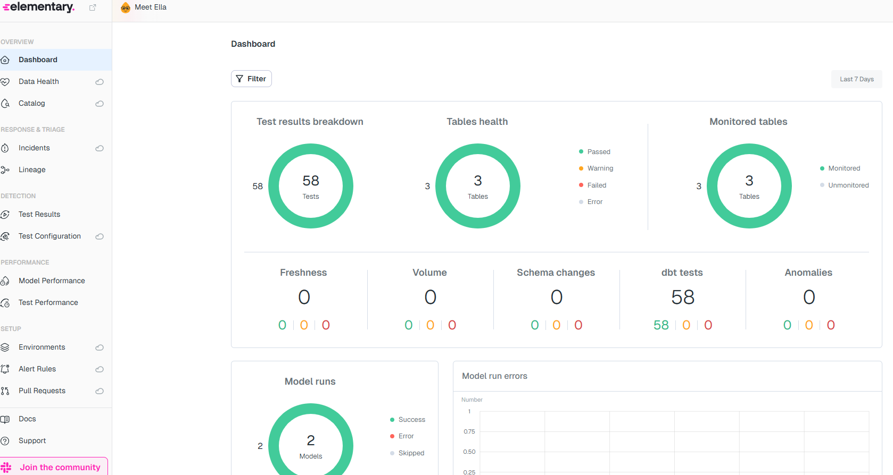 
</p>

## Incorporación de errores

Se añaden valores erróneos para probar la detección de anomalías:

<p align="center"> 
  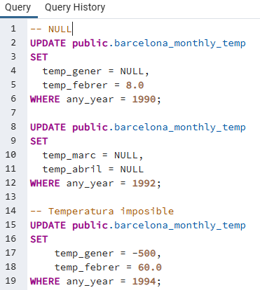 
</p>

Datos de la tabla original con filas afectadas por valores nulos y atípicos:

<p align="center"> 
  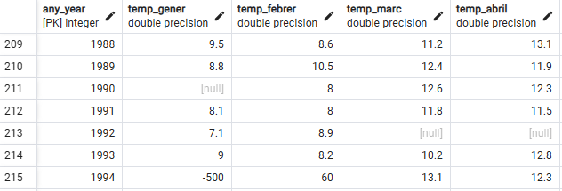 
</p>

## Visualización de errores en Elementary

Después de añadir los errores, se vuelve a ejecutar:

```bash
dbt run
dbt test
dbt run --select elementary
edr report
```

Dashboard de **Elementary** mostrando los tests en rojo:

<p align="center"> 
  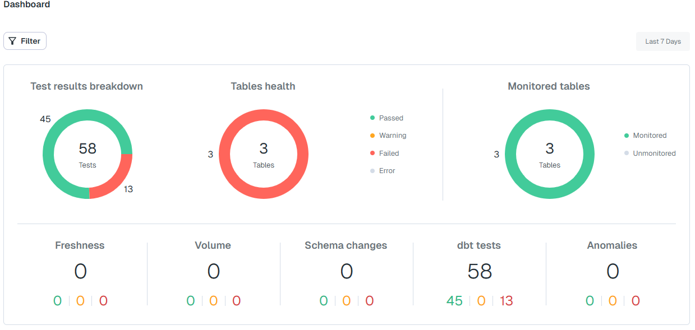 
</p>

Tests de la tabla source que no pasaron:

<p align="center"> 
  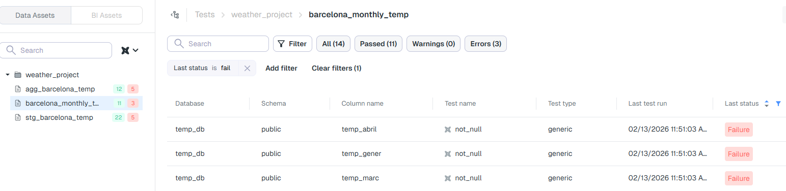 
</p>

Tests de la vista `stg` que no pasaron:

<p align="center"> 
  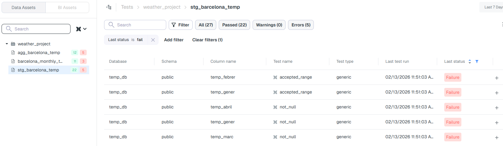 
</p>

Tests de la vista `agg` que no pasaron:

<p align="center"> 
  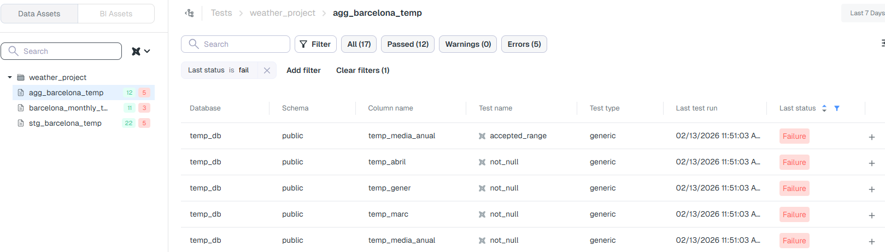 
</p>

## Conclusiones sobre la ejecución local

Hemos visto que, en local, **Elementary** utiliza las métricas generadas por **dbt** para monitorear la integridad de los datos y ejecutar los tests definidos. Esto permite validar la calidad de los datos y detectar errores básicos, pero tiene limitaciones: la detección avanzada de anomalías, alertas automáticas, dashboards históricos y análisis de causa raíz requieren un data warehouse en la nube.

En el siguiente apartado, pasaremos a configurar **BigQuery** como warehouse en la nube, lo que nos permitirá aprovechar al máximo las capacidades de **Elementary** y ejecutar un monitoreo de datos completo en producción.

## Migración a Cloud con BigQuery

**Elementary Cloud** ofrece todas las funcionalidades avanzadas, pero requiere acceso a un *data warehouse* público o a una VPC accesible desde internet. Por ello, pasamos a utilizar **BigQuery** como destino.

### 1. Crear los datasets en BigQuery

Creamos dos datasets en nuestro proyecto:

* `temp_db`: para almacenar los datos originales.
* `temp_db_elementary`: para almacenar las métricas y resultados que **Elementary** genera automáticamente.

```bash
bq mk --dataset --location={region} {project}
bq mk --dataset --location={region} {project}
```

### 2. Cargar los datos desde Postgres a BigQuery

Exportamos los datos (incluyendo los errores) desde nuestra base local **Postgres** y los cargamos en **BigQuery**:

```bash
bq load --source_format=CSV --skip_leading_rows=1 \
{project}:{database}.{table} \
barcelona_monthly_temp.csv \
any_year:INTEGER,temp_gener:FLOAT,temp_febrer:FLOAT,temp_marc:FLOAT,temp_abril:FLOAT,temp_maig:FLOAT,temp_juny:FLOAT,temp_juliol:FLOAT,temp_agost:FLOAT,temp_setembre:FLOAT,temp_octubre:FLOAT,temp_novembre:FLOAT,temp_desembre:FLOAT
```

> Nota: Mediante el comando anterior definimos el esquema de los datos. Además, cambiamos los valores `NULL`  a "vacío" del *CSV* descargado de **Postgres** que aparecían como texto, ya que se interpretan en **BigQuery** como espacios vacíos.

<p align="center"> 
  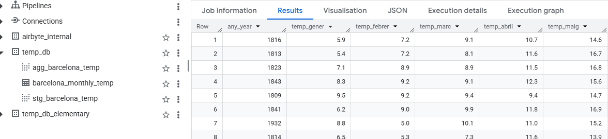 
</p>

### 3. Configurar Elementary para BigQuery

Instalamos la versión de **Elementary** compatible con **BigQuery**:

```bash
pip install elementary-data[bigquery]
```

Luego generamos la configuración que indica a **Elementary** dónde almacenar las métricas y cómo conectarse al *warehouse*:

```bash
dbt run-operation elementary.generate_elementary_cli_profile --profiles-dir C:\Users\{user}\.dbt
```

### 4. Ajustes en el proyecto dbt

Modificamos `sources.yml` para que las fuentes apunten al proyecto y dataset correctos en **BigQuery**:

```yaml
#database: temp_db  Postgres
#schema: public     Postgres
database: spa-datajuniorsprogram-sdb-001   # proyecto bigquery
schema: temp_db                             # dataset bigquery
```

### 5. Ejecutar dbt

Con todo configurado, ejecutamos los comandos habituales para construir los modelos, correr los tests y generar las métricas de **Elementary**:

```bash
dbt run
dbt test
dbt run --select elementary
```

A partir de aquí, **Elementary** crea automáticamente todas las métricas y dashboards sobre `temp_db_elementary` en **BigQuery**, de forma similar a como lo hacía anteriormente en nuestro contenedor **Postgres** local.

### 6. Elementary Cloud

Finalmente, mediante **Elementary Cloud** conectamos nuestro data warehouse en **BigQuery**. 

<p align="center"> 
  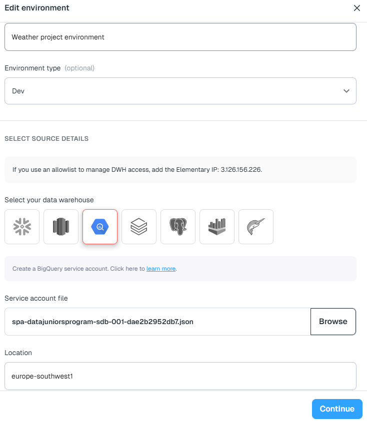 
</p>

<p align="center"> 
  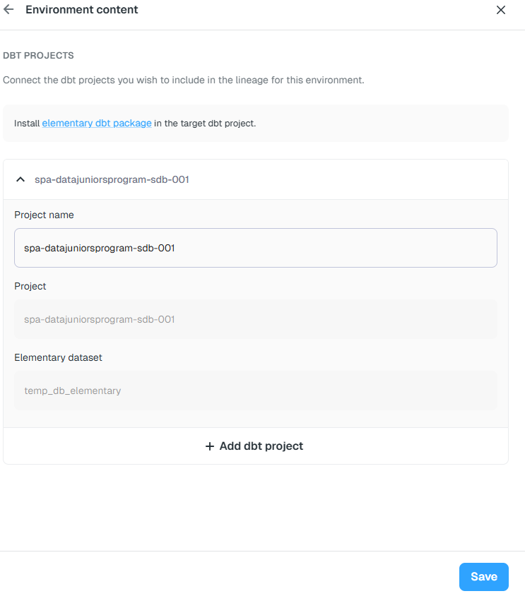 
</p>

Esto nos permite aprovechar todas las funcionalidades avanzadas que no estaban disponibles en local, incluyendo:

* **Colaboración y trazabilidad**: permite que varios usuarios revisen y comenten métricas, tests y resultados de manera centralizada.
* **Data Health**: visión completa del estado de la calidad de los datos de todos los pipelines.
* **Catalog**: inventario centralizado de todos los modelos, columnas y tablas con sus metadatos.
* **Incidents**: registro y seguimiento de incidencias detectadas en los datos.
* **Test Configuration**: gestión centralizada de los tests y métricas aplicadas a los datos.
* **Environments**: soporte para múltiples entornos (desarrollo, staging, producción) y su monitorización individual.
* **Alert Rules**: reglas configurables para recibir notificaciones automáticas cuando se incumplen criterios de calidad.
* **Pull Requests**: integración con flujos de trabajo colaborativos, permitiendo revisar cambios y métricas antes de desplegar.

De esta manera, **Elementary Cloud** transforma un simple monitoreo de integridad de datos en un sistema completo de *data observability*, listo para entornos de producción.

Comparativa de dashboards:

* **Dashboard Elementary local** (funcionalidades reducidas)
<p align="center"> 
   
</p>

* **Dashboard Elementary Cloud** (todas las funcionalidades disponibles)
<p align="center"> 
  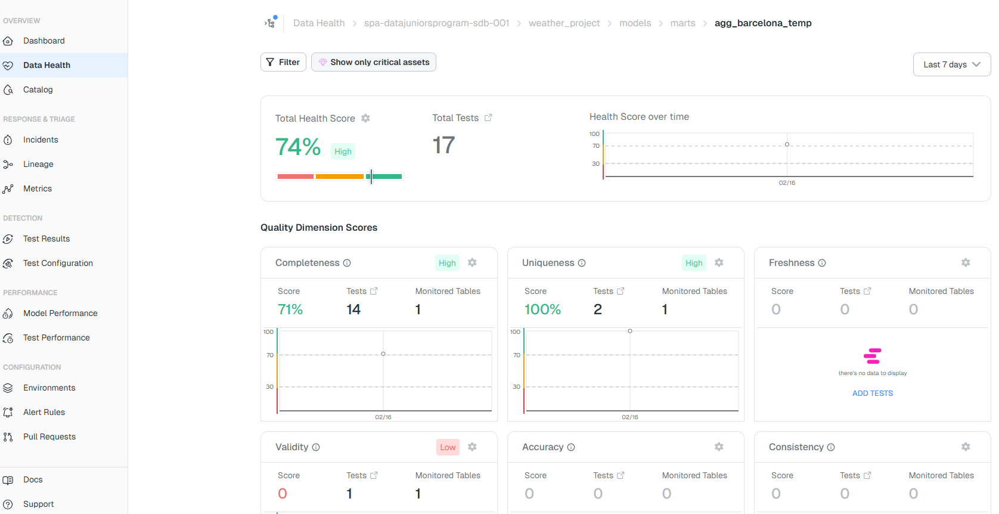 
</p>

## Conclusiones sobre la ejecución cloud

Al conectar **Elementary** a **BigQuery** y utilizar **Elementary Cloud**, conseguimos acceder a todas las funcionalidades avanzadas de observabilidad de datos, como detección automática de anomalías, alertas configurables, dashboards históricos, análisis de causa raíz o colaboración centralizada. Esto convierte la monitorización de datos en un sistema completo y listo para producción. Sin embargo, al depender de un servicio externo, no tenemos control total sobre los datos y su seguridad, lo que puede ser un inconveniente en entornos que manejan información sensible. Por ello, aunque **Elementary Cloud** potencia enormemente la observabilidad, en algunos casos un entorno local con un warehouse propio puede ser suficiente para validar la calidad de los datos sin comprometer el control interno.
